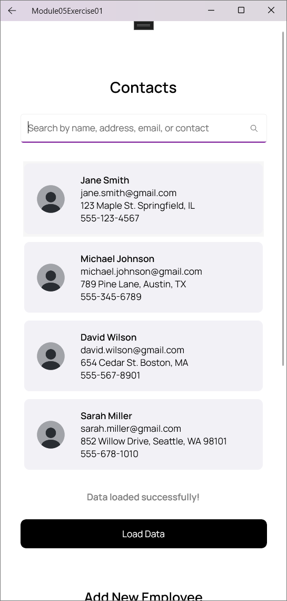
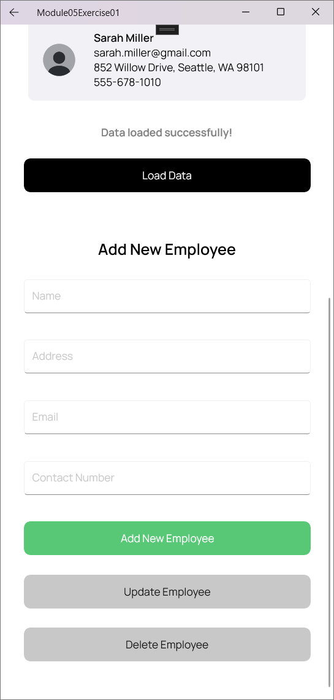
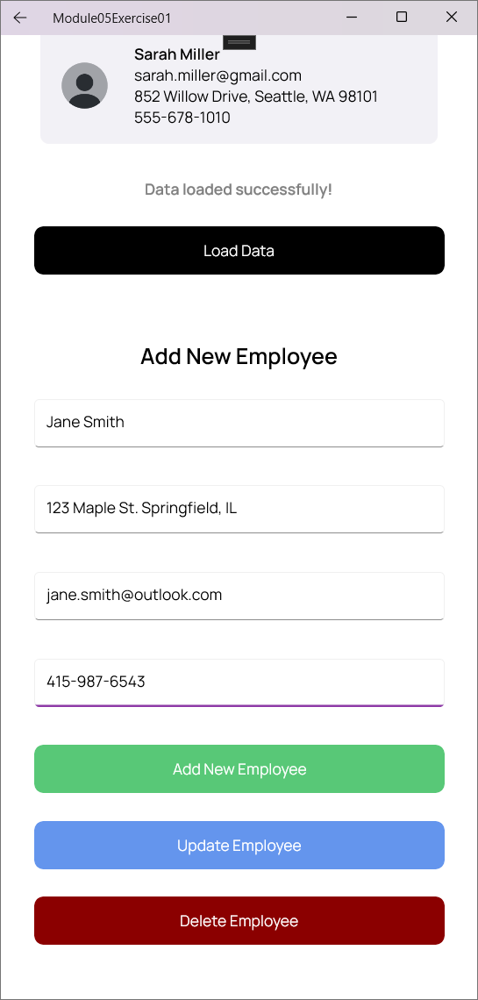
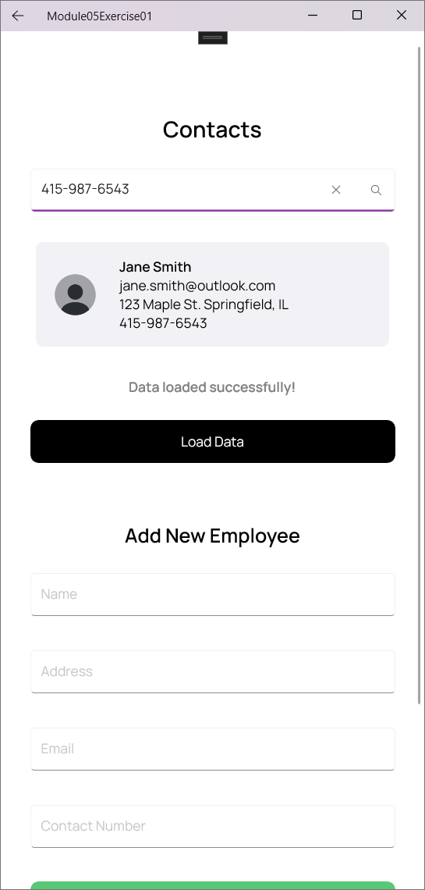

# PDC50-LAB Module 05 - Exercise 03

## Main Page Screenshot

    
    

## ViewEmployee Page Screenshot

    
    

## Update Employee Test
### Update Employee Screenshot

    

## Searching an Employee Test
### Searching an Employee Screenshot

    

