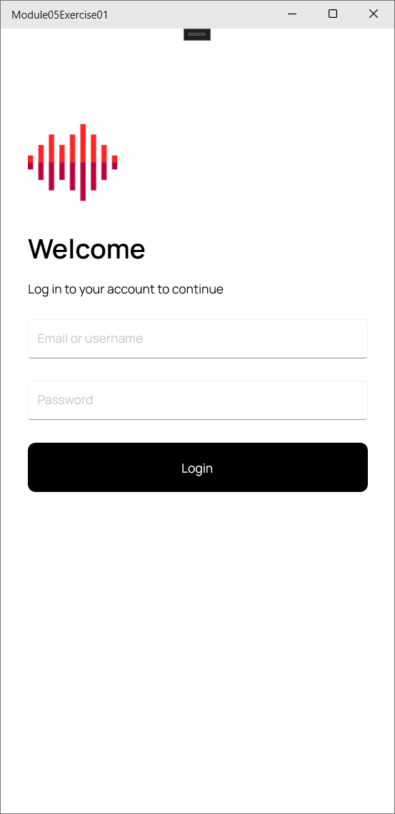
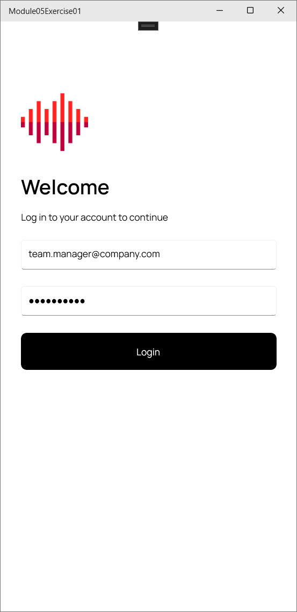
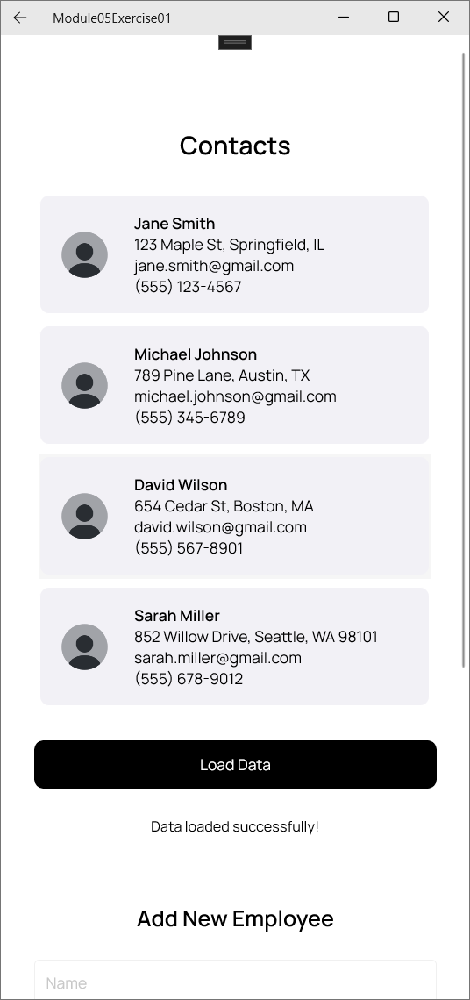
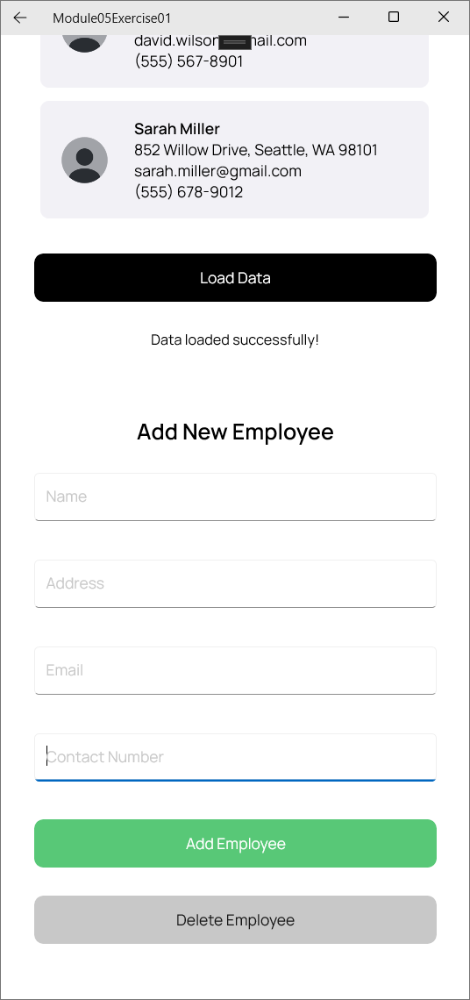
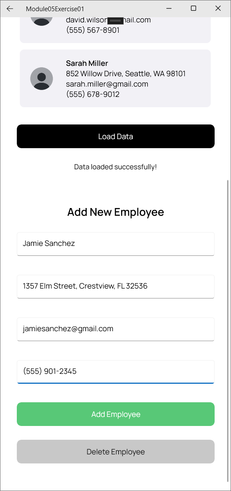
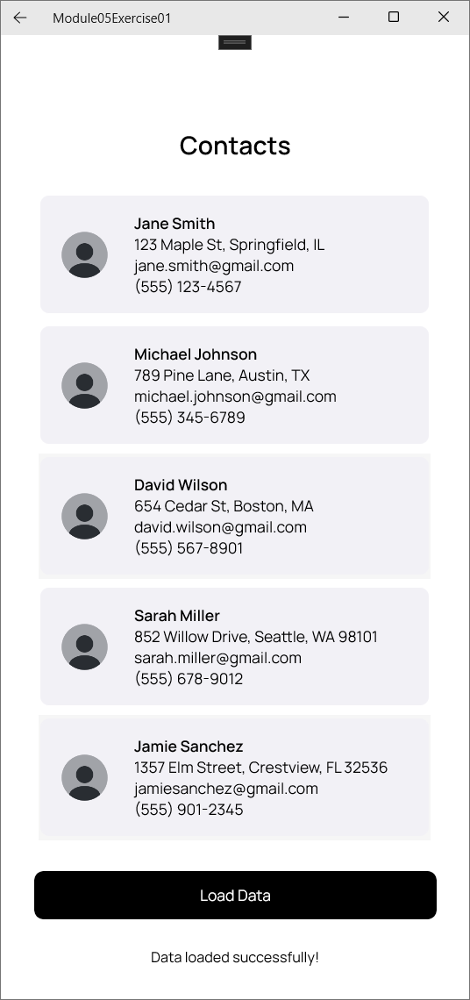
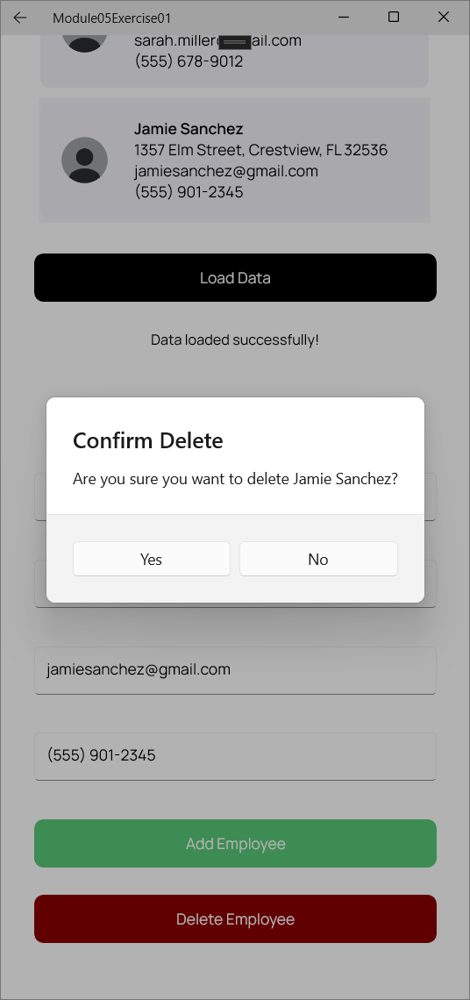
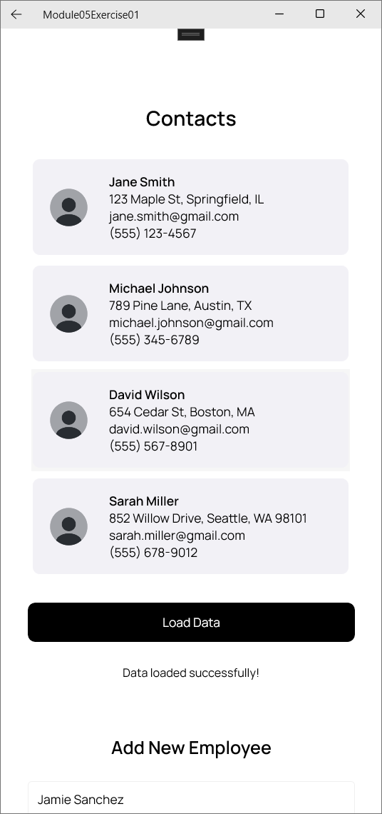

# PDC50-LAB Module 05-Exercise 02

## Main Page Screenshot

    
    

## ViewEmployee Page Screenshot

    
    

## Add New Employee Test
### Add New Employee Screenshot

    

### Contact List After Addition Screenshot

    

## Delete Employee Test
### Delete Employee Screenshot

    

### Contact List After Deletion Screenshot

    

